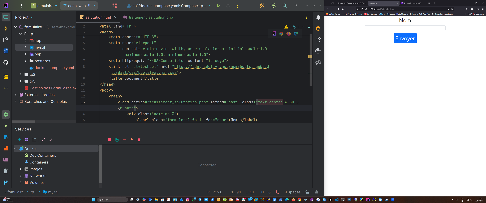

# PHP Lab – Interactive Forms

This project includes three basic PHP exercises designed to practice working with HTML forms and server-side processing using PHP.

## 🧪 TP 1 – Greeting Form

**Objective:**  
Create a form that asks for the user's name and displays a greeting message.

**Files:**
- `salutation.html`
- `traitement_salutation.php`

**Screenshot:**  

---

## ➕ TP 2 – Calculator Form

**Objective:**  
Create a form that asks for two numbers and displays their sum.

**Files:**
- `calcul.html`
- `traitement_calcul.php`

**Screenshot:**  

---

## 🎯 TP 3 – Guessing Game Form

**Objective:**  
Create a form that asks the user to guess a number and checks if it matches the correct number (e.g., 42).

**Files:**
- `devinette.html`
- `traitement_devinette.php`

**Screenshot:**  

---

## ✅ Expected Results

Each exercise includes:
- A basic HTML form
- PHP file to process the form
- Displaying a result or response message

---

## 🛠️ Technologies Used

- HTML
- PHP

---

## ℹ️ Author

[**Job Makombela**] – Student at [EEDN]
